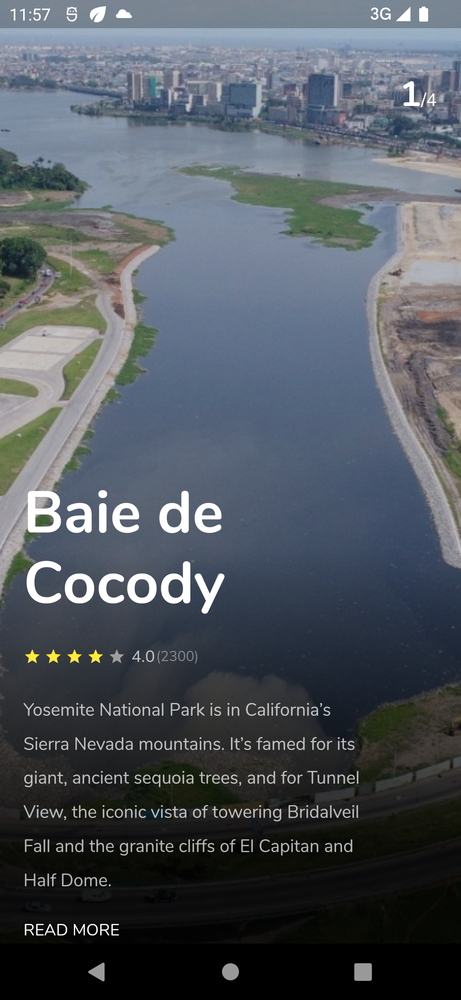
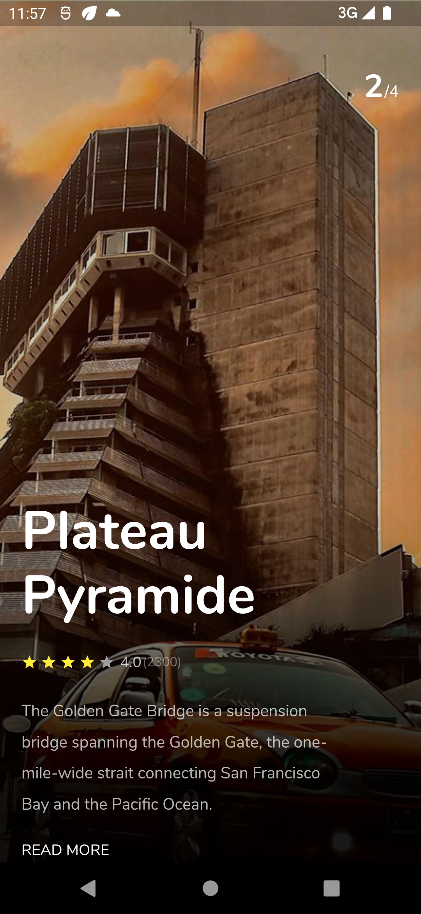
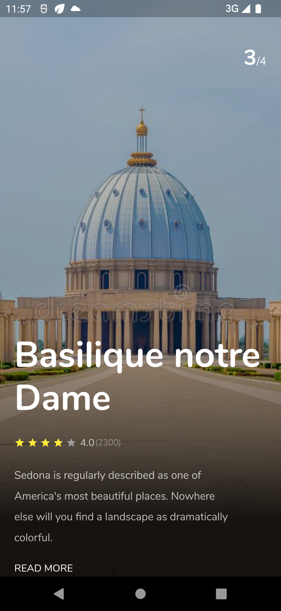
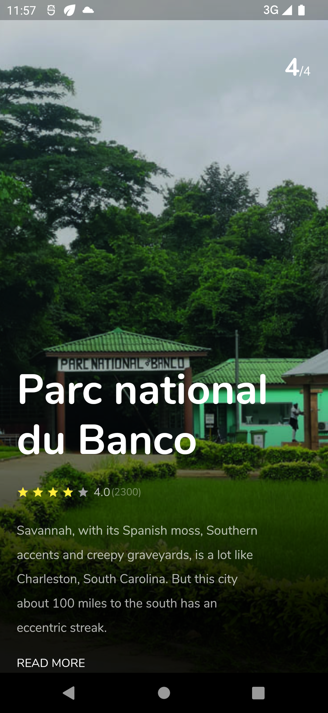

## Flutter Trip App UI Design - Day 2

```dart
class Day2 extends Flutter100DaysOfCode {
  video() {
    return {
      "title": "Flutter UI Concept App Design",
      "description": "Let's work with PageView and add some animation.",
      "day": 2,
      "videoLink": "#"
    }
  }
}
```

## Previous Designs
[Checkout my LinkedIn account](https://www.linkedin.com/feed/update/urn:li:activity:7029010943321743363/)


## Development Setup
Clone the repository and run the following commands:
```
flutter pub get
flutter run
```

## ScreenShots

 &nbsp; &nbsp;
&nbsp;



## Links

* [LinkedIn](https://www.linkedin.com/in/patrick-wilfried-kamelan-2b388a115/)
* [Twitter](https://twitter.com/KamelanPatrick)
* [Instagram](https://www.instagram.com/patrickispoppin/)
